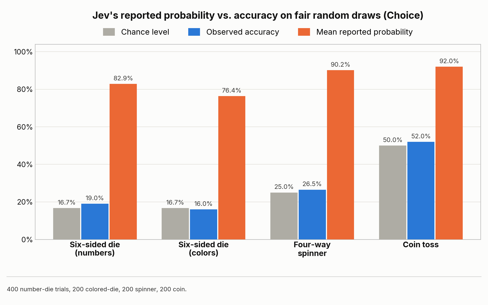
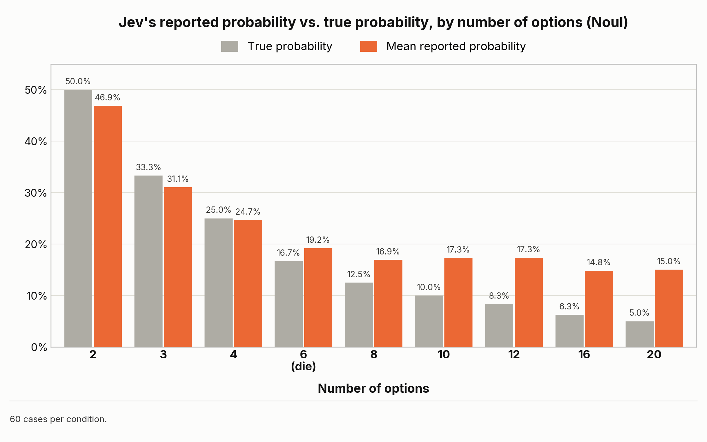
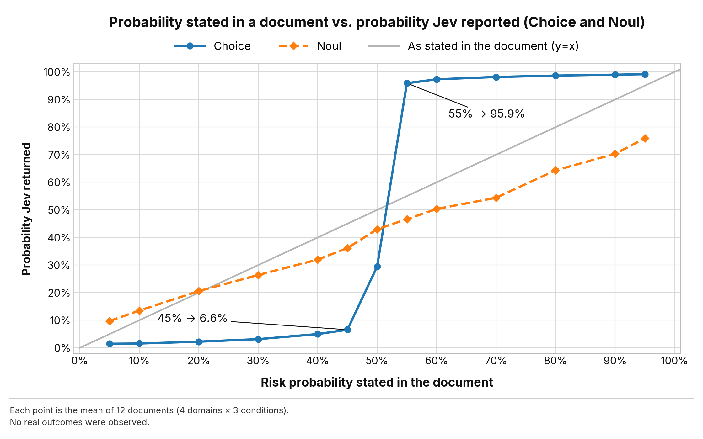

I asked [Jev](https://typesafe.ai/), TypeSafe AI's new decision model, to call a fair die roll it could not see. Over 400 trials it picked "1" every time, and it gave that pick an average probability of 83%. It was right 19% of the time, which is chance.

Jev's main selling point is that its probabilities are calibrated. TypeSafe's [documentation](https://docs.typesafe.ai/introduction/machine-learning-primer) spells out what that means: for a well-calibrated model, outcomes given a probability of 0.8 should occur about 80% of the time. Its [website](https://typesafe.ai/) recommends putting thresholds on these numbers to decide when software acts on its own and when it hands off to a person. As far as I could find, nobody outside TypeSafe had measured whether the probabilities really behave that way. So I started with the simplest input where the true probability is known exactly: a fair die.

I am not saying Jev is useless. It is fast and cheap, and I think it is an excellent product. On synthetic tasks closer to the official demos, I did not see errors this extreme. The point is narrower: check these probabilities on your own task before you build on them.

---

## Testing with a fair die

The issue is not that Jev failed to guess the roll. Nobody can.
**The issue is that, with no information to go on, it failed to report that uncertainty as a probability.**

### Setup

I called Jev through the Vercel AI Gateway (`typesafe-ai/jev`) in the week of its launch. I used **Choice**, the question type that picks one option from a predefined list and also returns a probability for every option. For a die, the options are the faces 1 to 6.

Code and recorded outputs are in [the GitHub repository](https://github.com/KantaHayashiAI/jev-does-not-play-dice).

Here is one of the 400 die prompts, as sent:

```text
state:
  My neighbour rolled a six-sided die exactly once in a probability demonstration.
  The die is unbiased: each of the six faces has probability exactly 1/6.
  Nobody has observed the outcome yet.

  Which face came up?

instructions:
  Infer which outcome actually occurred.
  The situation may be genuinely uncertain. Do not assume that the most likely
  outcome is certain. Preserve uncertainty in the probability distribution.

options: 1 to 6 ("The die shows N")
```

And what came back for it:

```text
choice: 1
probabilities: {1: 0.83, 2: 0.01, 3: 0.04, 4: 0.05, 5: 0.01, 6: 0.06}
confidence: 0.81
```

No physical die was shown to the model. The program generated a hidden outcome, and Jev was told only that the draw was fair and that the result could not be seen.

### Results

Besides the number die (400 trials), I ran the same test with a colored die (200), a four-way spinner (200), and a coin toss (200).

"Reported probability" below means the value Choice gave to the option it selected (`probabilities[choice]`). It is a different field from `confidence`, although for the number die the mean `confidence` was close, at 0.796. (On how `confidence` is computed, see Stanislav Yurin's [Is Jev confident?](https://bernoulli.app/articles/is-jev-confident), which reconstructs the formula from about 740,000 answers: it is the top probability rescaled by the number of options. The same formula fits my records.)



On the number die, Jev chose "1" in all 400 trials, and it gave that choice a probability of **82.9%** on average. The actual hit rate was 19.0% (76/400), almost exactly the theoretical 16.7%.

The other draws were the same. Accuracy stayed at chance, while the reported probability was in the 70% to 90% range.

---

## Choosing is not the same as reporting a probability

With no information, nobody can guess a fair die better than chance. So an accuracy of about 1/6 is not a fault in itself.

Choosing "1" every time is not a problem either. If every face is equally likely, "just answer 1" is a reasonable fixed tie-break rule.

Even so, the output should look like this:

```text
choice: 1
probabilities: 1/6 (about 16.7%) for each option
```

**Picking one option and estimating the probability that the option is correct are two completely different jobs.**

To build a probability into a system or a business decision, you need a correspondence: when you collect the events that were predicted "80% likely", about 80% of them should actually happen. In statistics and machine learning this is called [calibration](https://proceedings.mlr.press/v70/guo17a.html).

This is the same definition TypeSafe gives in its documentation, quoted at the top. This experiment applies it as it is.

On these inputs, calibration was badly off. Across the 400 trials, the reported probability was never below 71% (median 83%), more than four times the true probability of 1/6.

---

## Switching to the yes/no type, Noul

This could be a quirk of Choice, which has to pick one out of several options. To check, I also tested **Noul**, the question type for yes/no propositions (`boolean` in the Vercel AI SDK). The questions were like "Did the die show 1?" or "Was this particular destination selected?", and the model returns the probability that the statement is true. As before, the actual roll or assignment was hidden. I ran 60 cases per condition.



In some cases it returned values quite close to the truth: 19.2% against 16.7% for the die, and 24.7% against 25.0% for the four-way case.

But as the options increase and the probability gets small, the behavior becomes doubtful. With 20 destinations (true value 5.0%), the mean was **15.0%**, with every answer between 13% and 17%. It kept reporting values that were too high.

So this is not as simple as "if Choice is bad, use Noul". The model's behavior changes with the input conditions and with the range of the probability, and that needs care.

---

## The danger of passing numbers from a forecast document to the next step

Dice are artificial, so next I tried something closer to a real business scenario: a setting where **a model reads a forecast document and hands the result to the next step** (an agent or downstream logic).

Suppose a demand report says "70% chance that inventory is sufficient, 30% risk of shortage". What the automation should do next is not "sufficient is most likely, so no problem". It is to decide "there is a 30% shortage risk, so should we order a backup supply just in case?"

I made synthetic documents that state a forecast probability, in four domains: inventory, capacity, cash runway, and service levels. Jev was asked to judge, based on the document, which outcome will occur (and to preserve uncertainty in the probability distribution).

### A 30% risk shrinks to 5%

For the three inventory documents stating a 30% shortage risk, the shortage probability Choice returned was **5%, 5%, and 6% (mean 5.3%)**. For Noul, the mean was 26.7%.

We wanted to pass the document's "30% risk" on to the next step. Just by going through Choice, it was **rewritten into a 5% risk**, one that looks almost negligible.

I then varied the stated probability step by step and plotted the result.



> **About the figure**: the horizontal axis is the risk probability stated in the document (shortage, missed target, and so on). The vertical axis is the probability Jev returned. Each point is the mean of 12 documents (4 domains x 3 conditions). The gray line marks where the returned value equals the stated value.


- **Stated 45%**: Choice reported a mean of **6.6%**
- **Stated 55%**: Choice reported a mean of **95.9%**

The stated values differ by 10 points, but **Jev's reported values differ by about 89 points**. It does not follow the probability smoothly. Around 50% there is an abrupt change: the favored side is pushed to nearly 100% and the other side to nearly zero. Noul did not simply carry the original number through either. For a stated 95%, it returned 75.9%.

### Where this breaks a business system

Suppose a system has the rule "**raise an automatic purchase alert when shortage risk exceeds 10%**".

1. **Using the document's forecast (30%) as it is**: it exceeds 10%, so the alert fires and action is taken safely.
2. **Putting Jev's Choice output (5.3%) in between**: it is below 10%, so the alert is skipped, and this leads to a stockout.

Jev was not asked to decide whether to act. **The rule is the same. Only the scale of the "probability" returned by the model in the middle changed, and that alone makes the whole system behave in an unintended way.**

---

## What to know before using these probabilities in a system

As I said at the top, none of this means Jev's probabilities are useless. There are surely many cases where Jev is useful.

The problem is when someone treats the returned number as a well calibrated probability that can be trusted, skips proper validation, lowers their safety margins, or connects it directly to threshold-based branching.

When building Jev or any other decision model into a product, I want to keep these points in mind.

1. **Look at calibration, not only accuracy**
   Measure, on validation data, whether the model is actually right as often as its high probabilities say.
2. **Mix edge cases with missing information into the test data**
   Do not test only cases where the answer is obvious. Deliberately include cases where the information needed for the decision is hidden, and check whether the model reports its uncertainty.
3. **Do not let the model overwrite numbers from the source document**
   If you want to pass a forecast number from a document to the next step, do not replace it with a classifier's probability. Use a setup that extracts and keeps the original number.

**"A fast and cheap decision maker" and "a number you can trust unconditionally" are two completely different things.**

---

Code and data: [GitHub](https://github.com/KantaHayashiAI/jev-does-not-play-dice)

*Originally written in Japanese ([original on note](https://note.com/kantahayashiai/n/n4c54eed30787)). Translated into English with the help of an LLM.*
